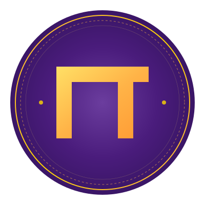

# PiDAOSphere

<div align="center">
  
  
  A fair token launch platform combining Pi Network's user base with Solana's blockchain infrastructure.
</div>

## Overview

PiDAOSphere is an innovative platform that bridges Pi Network and Solana ecosystems, providing a fair and transparent token launch mechanism with special benefits for Pi holders. By combining Pi Network's massive user base and robust identity verification with Solana's high-performance blockchain infrastructure, we create a unique platform for launching and trading meme tokens in a fair and efficient manner.

## Important Links

### Pi Network Resources
- **Pi Developer Portal**: [https://minepi.com/developers/#Pi_Browser](https://minepi.com/developers/#Pi_Browser)
- **Pi Platform Documentation**: [https://github.com/pi-apps/pi-platform-docs](https://github.com/pi-apps/pi-platform-docs)
- **Pi Browser Documentation**: [Pi Browser Guide](https://minepi.com/developers/#Pi_Browser)

## Why PiDAOSphere?

### Pi Network Integration Benefits
- **Massive User Base**: Access to Pi Network's 35M+ active users worldwide
- **KYC Verification**: Leverage Pi Network's identity verification system to prevent bot manipulation
- **Fair Distribution**: Ensure tokens are distributed to real users rather than automated bots
- **Community Trust**: Built on Pi Network's established community trust and engagement

### Solana Blockchain Advantages
- **High Performance**: 65,000+ TPS with sub-second finality
- **Low Cost**: Transaction fees under $0.01
- **Rich DeFi Ecosystem**: Access to Solana's mature DeFi infrastructure
- **Smart Contract Support**: Advanced programmability with Rust-based smart contracts

### DAOS.fun Model Adaptation
- **Proven Success**: Based on successful meme token launch model
- **Community Governance**: True DAO-based decision making
- **Fair Launch Mechanism**: Equal opportunity for all participants
- **Anti-Bot Measures**: Combining Pi Network KYC with Solana smart contracts

## Technical Architecture

### Pi Network Integration Details

#### SDK Implementation
```javascript
// Frontend SDK Integration
<script src="https://sdk.minepi.com/pi-sdk.js"></script>
<script>Pi.init({ version: "2.0" });</script>

// Authentication Flow
const scopes = ['payments'];

function onIncompletePaymentFound(payment) {
  // Handle incomplete payment
  console.log(payment);
}

Pi.authenticate(scopes, onIncompletePaymentFound).then(function(auth) {
  // Handle successful authentication
}).catch(function(error) {
  // Handle authentication error
});

// Payment Implementation
Pi.createPayment({
  amount: amount,
  memo: "Token Purchase", 
  metadata: { projectId: "xyz" },
}, {
  onReadyForServerApproval: function(paymentId) {
    // Handle server approval
  },
  onReadyForServerCompletion: function(paymentId, txid) {
    // Handle payment completion
  },
  onCancel: function(paymentId) {
    // Handle payment cancellation
  },
  onError: function(error, payment) {
    // Handle payment error
  },
});
```

#### Backend Integration
```typescript
// Server-side payment verification
app.post('/payments/verify', async (req, res) => {
  const { paymentId } = req.body;
  try {
    const payment = await piNetworkService.verifyPayment(paymentId);
    // Process payment verification
    res.json({ success: true });
  } catch (error) {
    res.status(500).json({ error: 'Payment verification failed' });
  }
});
```

### Core Components

1. **Pi Network Layer**
   - User Authentication via Pi SDK
   - Payment Processing
   - KYC Verification
   - Platform API Integration

2. **Smart Contract Layer (Solana)**
   - Token creation and management
   - Investment handling
   - DAO governance implementation
   - Cross-chain bridge contracts

3. **Backend Services**
   - **API Server**: Node.js + Express
   - **Authentication**: [Pi Network SDK](https://github.com/pi-apps/pi-platform-docs/blob/master/SDK_reference.md) integration
   - **Database**: PostgreSQL for user data
   - **Cache**: Redis for performance optimization
   - **Queue**: Bull for job processing

4. **Frontend Application**
   - React + TypeScript
   - Chakra UI components
   - Wallet integration (Phantom, Solflare)
   - Real-time updates with WebSocket

5. **Infrastructure**
   - Kubernetes deployment
   - CloudFlare for CDN
   - AWS for cloud services
   - Prometheus + Grafana for monitoring

### Directory Structure
```
pidaosphere/
├── src/                    # Source code
│   ├── contracts/         # Solana smart contracts
│   ├── services/         # Backend services
│   ├── frontend/         # React frontend
│   └── utils/            # Shared utilities
├── programs/             # Anchor program files
├── tests/                # Test suites
├── docs/                 # Documentation
└── k8s/                  # Kubernetes configs
```

## Working Principles

### Token Launch Process
1. **Project Creation**
   - Team submits project proposal
   - Community reviews and votes
   - Smart contract deployment

2. **Fair Launch**
   - Equal opportunity for all participants
   - Investment caps based on Pi holdings
   - Anti-bot measures active

3. **Token Distribution**
   - Automatic distribution via smart contracts
   - Vesting schedules if applicable
   - Liquidity pool creation

### Cross-Chain Bridge Mechanism
1. **Pi Network to Solana**
   - Lock Pi tokens in escrow
   - Mint wrapped tokens on Solana
   - Smart contract verification

2. **Solana to Pi Network**
   - Burn wrapped tokens
   - Release original tokens
   - Cross-chain verification

### DAO Governance
1. **Proposal Creation**
   - Any token holder can propose
   - Minimum token requirement
   - Clear execution parameters

2. **Voting Process**
   - Token-weighted voting
   - Quadratic voting option
   - Time-locked execution

3. **Execution**
   - Automatic execution of passed proposals
   - Multi-sig security
   - Transparent verification

## Why Pi Network for Memecoins?

### Community Advantages
1. **Active User Base**
   - 35M+ engaged users
   - Strong community focus
   - Global distribution

2. **Fair Participation**
   - KYC verified users
   - Bot-free environment
   - Equal opportunity

3. **Mobile First**
   - Easy mobile access
   - In-app interactions
   - Simplified UX

### Technical Benefits
1. **Identity System**
   - Built-in KYC
   - Sybil resistance
   - Trust network

2. **Scalability**
   - Mobile-optimized
   - Low resource requirements
   - Fast transactions

3. **Integration**
   - Native mobile SDK
   - Simple API integration
   - Unified user experience

## Security Features

### Platform Security
- Multi-signature requirements
- Time-locked transactions
- Rate limiting and anti-DOS
- Regular security audits

### User Protection
- Investment caps
- Gradual token unlocks
- Transparent pricing
- Emergency pause functionality

### Smart Contract Safety
- Formal verification
- Multiple audits
- Bug bounty program
- Upgrade mechanism

## Development Status

### Current Features
- [x] Smart contract core
- [x] Pi Network integration
- [x] Basic frontend
- [x] Security measures

### In Development
- [ ] Advanced DAO features
- [ ] Mobile optimization
- [ ] Additional token utilities
- [ ] Enhanced analytics

## Development Guidelines

### Pi Network Compliance
1. **Browser Compatibility**
   - Must run in Pi Browser
   - Mobile-first design
   - Responsive UI implementation

2. **Authentication Flow**
   - Proper scopes implementation
   - Error handling
   - Session management

3. **Payment Processing**
   - Server-side verification
   - Transaction confirmation
   - Error recovery

4. **Security Requirements**
   - SSL/TLS encryption
   - API key management
   - Rate limiting implementation

## Contact & Support

- **Website**: https://www.pidaosphere.com
- **Email**: support@pidaosphere.com
- **Twitter**: https://x.com/pidaosphere
- **GitHub**: https://github.com/pidaosphere/PiDAOSphere

## Acknowledgments

- Pi Network Team
- Solana Foundation
- Anchor Framework Team
- Open Source Community